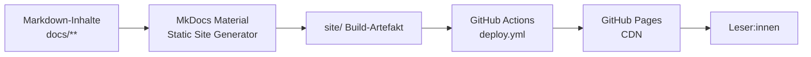
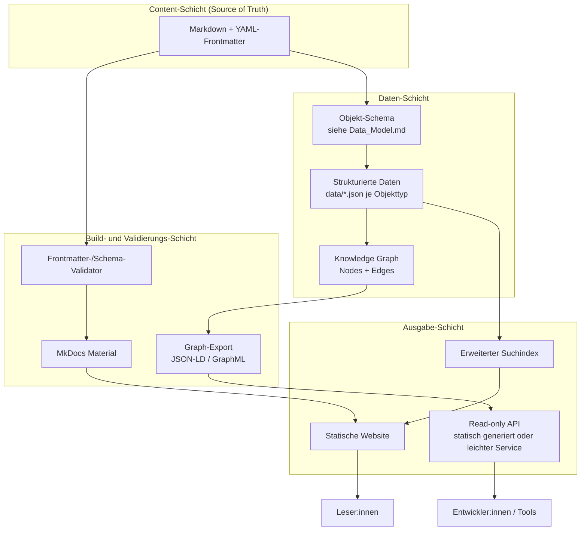

# Architecture

Dieses Dokument beschreibt die **aktuelle Architektur** (Stand v0.1) sowie eine **Zielarchitektur** für einen Zeithorizont von ca. 5 Jahren. Die Zielarchitektur ist eine Leitplanke für Entscheidungen, kein verbindlicher Bauplan, der sofort umgesetzt wird — siehe [Release Strategy](Release_Strategy.md) für die tatsächliche Reihenfolge.

## Grundprinzip: Static-First

Peptide Atlas bleibt so lange wie möglich eine **statische, serverlose Plattform**. Das reduziert Betriebsrisiko, Kosten und Angriffsfläche erheblich und passt zu einer Wissensbasis, die sich in Lesehäufigkeit stark von Schreibhäufigkeit unterscheidet (viele Leser, wenige, redaktionell geprüfte Änderungen). Ein Wechsel zu einer serverbasierten Architektur sollte erst erfolgen, wenn ein konkretes Feature (z. B. eine schreibende API oder Nutzerinteraktion) das zwingend erfordert.

## Aktuelle Architektur (v0.1)

- **Content-Schicht**: Markdown-Dateien mit YAML-Frontmatter unter `docs/`.
- **Build**: MkDocs Material, lokal per `mkdocs build --strict` reproduzierbar.
- **Deployment**: GitHub Actions (`upload-pages-artifact` + `deploy-pages`), kein separater `gh-pages`-Branch.
- **Suche**: client-seitiges `search`-Plugin (Lunr-basiert), keine externe Abhängigkeit.
- **Hosting/CDN**: GitHub Pages, HTTPS erzwungen.
- **Versionierung**: Git als alleinige Quelle der Wahrheit.

## Zielarchitektur (Leitplanke, ~5 Jahre)

### Komponenten im Detail

**Frontend**
: Weiterhin serverlos gerenderte, statische HTML-Seiten (MkDocs Material). Ein Wechsel zu einem App-Framework (z. B. Next.js) wird erst relevant, falls interaktive Visualisierungen (siehe [Knowledge Graph](Knowledge_Graph.md)) das erfordern — dann als **Ergänzung**, nicht als Ersatz der statischen Seiten.

**Backend**
: Aktuell nicht vorhanden und nicht benötigt. Zielbild: falls überhaupt, ein **schreibgeschützter** Dienst, der ausschließlich generierte, redaktionell freigegebene Daten ausliefert — kein Backend mit Nutzer-Login oder Schreibzugriff von außen.

**API**
: Perspektivisch eine read-only-Schnittstelle auf Basis der strukturierten Daten (`data/*.json` bzw. Graph-Export). Zunächst als statisch generierte JSON-Endpunkte denkbar (kein eigener Server nötig), erst bei konkretem Bedarf (z. B. Such- oder Filterfunktion, die serverseitige Logik braucht) als echter Service.

**Knowledge Graph**
: Separate, aus Frontmatter und expliziten Relationsangaben abgeleitete Graphstruktur. Siehe [Knowledge Graph](Knowledge_Graph.md) und [Data Model](Data_Model.md).

**Suche**
: Bleibt zunächst client-seitig. Bei wachsendem Content-Umfang (mehrere hundert Artikel) Evaluierung von Pagefind oder einem gehosteten Such-Index (z. B. Typesense/Meilisearch) — nur falls die client-seitige Suche spürbar an Grenzen stößt.

**AI**
: KI-Systeme unterstützen die Redaktion (Konsistenzprüfung, Formatierungsvorschläge, Verlinkungsvorschläge, Übersetzungsentwürfe), erzeugen aber **keine eigenständigen medizinischen Aussagen** und veröffentlichen nichts autonom. Jeder KI-Vorschlag durchläuft denselben Redaktionsprozess wie menschliche Beiträge (siehe [Contribution Guide](Contribution_Guide.md)).

**Datenhaltung**
: Git-Repository bleibt die primäre Datenhaltung. Strukturierte Daten (`data/`) werden als versionierte Dateien geführt, nicht in einer externen Datenbank — solange Schreibzugriffe selten und redaktionell kontrolliert bleiben.

**Deployment**
: GitHub Actions + GitHub Pages bleibt die Standardlösung. Ein Wechsel (z. B. eigenes Hosting) wird nur nötig, falls eine API mit dynamischem Verhalten hinzukommt, die GitHub Pages nicht abbilden kann.

**Versionierung**
: SemVer auf Plattformebene (siehe [Versioning](Versioning.md)), Git-Historie auf Artikelebene.

**Caching**
: Aktuell durch GitHub Pages' CDN abgedeckt. Bei einer künftigen API: HTTP-Caching-Header und ggf. ein vorgelagertes CDN, kein eigenes Cache-Backend, solange Daten schreibgeschützt sind.

**Internationalisierung**
: Vorbereitet, nicht aktiv (siehe [Vision](Vision.md), [Future Roadmap](Future_Roadmap.md)). Zielbild: `mkdocs-static-i18n` oder vergleichbares Plugin, sobald mehrsprachige Inhalte redaktionell geplant sind.

## Nicht-Ziele der Architektur

- Kein Nutzerkonto-System.
- Keine Kommentarfunktion.
- Keine Echtzeit-Kollaboration im Frontend.
- Kein Microservice-Wildwuchs — jede neue Komponente muss einen klaren, dokumentierten Zweck haben (siehe [Decision Log](Decision_Log.md)).
