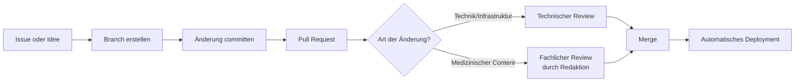

# Contribution Guide

## Rollen

| Rolle | Verantwortung | Darf inhaltlich freigeben? |
|---|---|---|
| **Wissenschaftliche Redaktion** | Fachliche Richtigkeit, Quellenprüfung, Evidenzstufen, Statusfreigabe | Ja — einzige Instanz mit inhaltlicher Freigabekompetenz |
| **Technische Entwicklung** | Plattform, Infrastruktur, Build, Deployment, Datenmodell/Tooling | Nein, für medizinische Inhalte |
| **KI-Systeme** | Unterstützung: Formatierung, Konsistenzprüfung, Verlinkungsvorschläge, Übersetzungsentwürfe, Strukturvorschläge | Nein — niemals autonome Freigabe |
| **Externe Contributor:innen** | Vorschläge über Issues/Pull Requests | Nein — jeder Beitrag durchläuft den regulären Review |

Diese Rollentrennung gilt unabhängig davon, ob ein Beitrag von einem Menschen oder einem KI-System stammt — entscheidend ist die **Art des Beitrags**, nicht wer ihn eingereicht hat.

## Leitplanken für KI-Nutzung

- KI-Systeme dürfen **keine medizinischen Fakten erfinden** oder Studienergebnisse zusammenfassen, ohne dass eine Quelle vorliegt.
- KI-generierte Vorschläge (Text, Struktur, Relationen im [Knowledge Graph](Knowledge_Graph.md)) erhalten immer Status `Entwurf` und durchlaufen den vollen Review nach [Quality Standards](Quality_Standards.md).
- KI-Unterstützung ist ausdrücklich erwünscht für: Rechtschreibung/Grammatik, Konsistenz der Formatierung, Vorschläge für interne Verlinkung, technische Dokumentation (wie dieses Dokument), Übersetzungsentwürfe (sobald Mehrsprachigkeit relevant wird, siehe [Future Roadmap](Future_Roadmap.md)).
- KI-Unterstützung ersetzt **nie** den fachlichen Review durch die wissenschaftliche Redaktion.

## Ablauf eines Beitrags

1. **Idee/Problem** wird als GitHub Issue erfasst (Bug, fehlender Inhalt, technische Verbesserung, Architekturvorschlag).
2. **Branch** wird nach der Konvention aus [Naming Conventions](Naming_Conventions.md) angelegt.
3. **Pull Request** referenziert das Issue und beschreibt die Änderung.
4. **Review** je nach Art (siehe [Workflow](Workflow.md) und [Editorial Policy](Editorial_Policy.md)).
5. **Merge** nach Freigabe — löst automatisches Deployment aus.

## Was ohne Review möglich ist

Nichts, was den Live-Stand verändert. Auch kleine Korrekturen laufen über einen Pull Request — es gibt keinen direkten Push auf `main` für Content- oder Konfigurationsänderungen (siehe [Workflow](Workflow.md)).

## Einstiegspunkte für neue Mitwirkende

- Technischer Einstieg: [Architecture](Architecture.md), [Data Model](Data_Model.md), README im Repository-Root
- Redaktioneller Einstieg: [Redaktionsstandard](../00_grundlagen/redaktionsstandard.md), [Evidenzsystem](../00_grundlagen/evidenzsystem.md), Artikelvorlage unter `templates/artikelvorlage.md` im Repository
- Begriffsklärung für Entwickler:innen: [Glossary for Developers](Glossary_For_Developers.md)
