# Evidence Curation Workflow

Dieses Dokument beschreibt den konkreten Zustandsübergang, den eine Information in Peptide Atlas durchläuft —
vom ersten Suchtreffer bis zum aktiven, veröffentlichten kanonischen Claim und seiner Einbindung in einen
Artikel. Es ergänzt das [Scientific Research Protocol](Scientific_Research_Protocol.md) (das *Verfahren*) um
die *Zustandsmaschine* (welche konkreten Objekte/Felder sich wann ändern).

!!! warning "Kernregel"
    **Automatisierung und KI dürfen Informationen finden, strukturieren und als Kandidaten markieren. Sie
    dürfen keine medizinische Aussage selbstständig als aktiven kanonischen Claim freigeben.** Jeder Übergang
    zu „aktiv" erfordert eine dokumentierte menschliche Entscheidung.

## Überblick

```mermaid
flowchart LR
    Z1["Search Result Manifest"] --> Z2["Candidate Manifest"]
    Z2 --> A[Suchtreffer]
    A --> B[Kandidat]
    B --> C[Deduplizierung]
    C --> D["Titel-/Abstract-Screening"]
    D --> E["Volltext-Screening"]
    E --> F[Eingeschlossene Quelle]
    F --> G[Extraktion]
    G --> H[Verifikation]
    H --> I[Kanonische Quelle]
    I --> J[Kanonische Studie]
    J --> K[Atomare Kandidatenclaims]
    K --> L["Wissenschaftlicher Review"]
    L --> M["Aktiver kanonischer Claim"]
    M --> N[Artikelintegration]
```

Jeder Kasten entspricht unten einem eigenen Abschnitt mit Eingabe, Ausgabe, verantwortlicher Rolle,
erforderlichen Prüfungen, Abbruchkriterien, gespeicherter Provenienz und möglichen Statuswerten.

## 1. Suchtreffer → Kandidat

| | |
|---|---|
| **Eingabe** | Ein Treffer aus einem ausgeführten Suchlauf (`search_run`). |
| **Ausgabe** | Ein neuer `screening_record` mit `decision: pending`. |
| **Rolle** | Rechercheur:in (kann automatisiert vorbefüllt werden — Titel, Identifikatoren). |
| **Erforderliche Prüfungen** | Keine inhaltliche Prüfung; nur strukturelle Erfassung (Titel, Identifikatoren, Quellentyp). |
| **Abbruchkriterien** | Kein Kandidat wird verworfen, ohne als `screening_record` erfasst zu werden — auch ein sofort erkennbar irrelevanter Treffer durchläuft mindestens `decision: exclude` mit Grund. |
| **Gespeicherte Provenienz** | `search_run_ids` (mindestens ein Suchlauf), `candidate_identifiers`. |
| **Mögliche Statuswerte** | `decision: pending`. |

!!! note "Woher stammt der Treffer wirklich?"
    Ein Suchlauf allein (Query + Trefferzahl) reproduziert kein historisches Ergebnis — Datenbanken verändern
    sich über Zeit. Welche Identifikatoren ein Suchlauf tatsächlich zum Ausführungszeitpunkt geliefert hat, steht
    versioniert im zugehörigen `research_search_result_manifest` (`result_capture.status: complete`, siehe
    [Scientific Research Protocol, Abschnitt 7a](Scientific_Research_Protocol.md#7a-search-result-manifests-versionierte-identifikatormengen)
    und ADR-0055 im [Decision Log](Decision_Log.md)) — nicht in einer neu ausgeführten Wiederholung der Query.

!!! info "Technische Vorstufe seit Phase 4B-1B-0: Candidate Manifest"
    Bevor ein einzelner Treffer als `screening_record` erfasst wird, normalisiert ein `research_candidate_manifest`
    (siehe [Scientific Research Protocol, Abschnitt 7b](Scientific_Research_Protocol.md#7b-candidate-manifests-technische-discovery-kandidaten)
    und ADR-0056 im [Decision Log](Decision_Log.md)) die protokoll- und datenbankgebundene
    Vereinigungsmenge mehrerer Search Result Manifests samt vollständiger Suchlauf-Herkunft und stabiler
    interner `candidate_id`. Das ist selbst **keine** Screening-Entscheidung — ein `screening_record` kann
    darauf über `candidate_manifest_id`/`candidate_id` zurückverweisen. Die Referenzpflicht ist seit dem
    CSO-Review zu ADR-0056 **datengetrieben** (nicht mehr eine feste Protokoll-Allowlist): existiert
    mindestens ein Candidate Manifest für ein Protokoll, ist die Referenz für neue, reale Screening
    Records dieses Protokolls verpflichtend.

!!! info "Automatische technische Initialisierung seit Phase 4B-1B-1"
    `tools/initialize_screening_records.py` (siehe [Scientific Research Protocol, Abschnitt 7c](Scientific_Research_Protocol.md#7c-automatische-screening-initialisierung)
    und ADR-0057 im [Decision Log](Decision_Log.md)) erzeugt für jeden Candidate-Manifest-Eintrag automatisch
    genau einen `screening_record` im rein administrativen Initialzustand (`decision: pending`,
    `decision_stage: deduplication`, `screened_by: system-screening-initializer`) — deterministisch,
    idempotent, ohne Netzwerkzugriffe. Dieser technische Akteur trifft **nie** eine wissenschaftliche
    Entscheidung; `pending` bedeutet hier ausschließlich „noch nicht gescreent", nicht „wahrscheinlich
    relevant". Die eigentlichen Schritte 2–5 dieses Dokuments (Deduplizierung bis terminale Entscheidung)
    bleiben unverändert menschliche/redaktionelle Schritte.

## 2. Kandidat → Deduplizierung

| | |
|---|---|
| **Eingabe** | Ein oder mehrere `screening_record`-Kandidaten mit überlappenden Identifikatoren. |
| **Ausgabe** | Entweder ein eigenständiger Kandidat (`decision_stage: deduplication` bestanden) oder ein als Duplikat markierter Kandidat (`decision: duplicate`, `duplicate_of: <Haupt-ID>`). |
| **Rolle** | Rechercheur:in, unterstützt durch automatisierte Identifikator-Normalisierung (siehe `deduplication_policy.identifier_priority`). |
| **Erforderliche Prüfungen** | Abgleich normalisierter DOI/PMID/PMCID/NCT-ID/ISBN (`tools/_researchlib.py`, wiederverwendet aus bzw. analog zu `tools/_datalib.py::normalize_*`) — von `tools/validate_research.py` tatsächlich durchgesetzt: zwei aktive (nicht `duplicate`-markierte) Kandidaten mit identischem normalisiertem Identifikator **innerhalb desselben Protokolls** sind ein Validierungsfehler. Kollisionen über verschiedene Protokolle hinweg sind erlaubt; URL-Kollisionen lösen nur eine Warnung aus. Seit ADR-0057: eine Kollision, an der noch mindestens ein nie menschlich übernommener, system-initialisierter Kandidat beteiligt ist (`screened_by: system-screening-initializer`), ist ebenfalls nur eine Warnung — die Deduplizierungsphase gilt für diese Gruppe erst als abgeschlossen, sobald ein Mensch jeden beteiligten Kandidaten übernommen hat; erst dann wird eine weiterhin ungelöste Kollision zum Fehler. |
| **Abbruchkriterien** | Ein Duplikat ohne eindeutigen Hauptdatensatz wird nicht automatisch aufgelöst — es bleibt `decision: uncertain`, bis eine Person entscheidet. Wählen Erst- und Zweitprüfung beide `duplicate`, aber mit unterschiedlichem Zielverweis (`primary_duplicate_of` ≠ `second_review.reviewer_duplicate_of`), ist das ebenfalls kein Konsens — `decision_confirmed` muss `false` sein, `decision` bleibt `uncertain` (keine Adjudikation an dieser Stufe möglich, ADR-0046/ADR-0052); der Widerspruch wird durch einen neuen `decision_history`-Eintrag gelöst. Auch bei bestätigtem Konsens muss die effektive `duplicate_of` exakt das bestätigte Ziel binden — ein davon abweichender, sonst gültiger dritter Hauptdatensatz ist ebenfalls ein Fehler (ADR-0053). |
| **Gespeicherte Provenienz** | `duplicate_of`, sowie `primary_duplicate_of`/`second_review.reviewer_duplicate_of` je Historieneintrag. Keine Zyklen zulässig, `duplicate_of` (und die gesamte Kette verketteter Duplikate) muss innerhalb desselben Protokolls bleiben — das gilt für die **effektive** Top-Level-`duplicate_of`. Die historischen Verweise (`primary_duplicate_of`/`reviewer_duplicate_of`/`decision_history[].duplicate_of`) sind referenziell (Ziel existiert, gleiches Protokoll, kein Selbstverweis), aber ohne Kettenverfolgung geprüft (siehe `tools/validate_research.py`, ADR-0052). |
| **Mögliche Statuswerte** | `decision: duplicate` \| `uncertain` \| (weiter zu Schritt 3). |

## 3. Deduplizierung → Titel-/Abstract-Screening

| | |
|---|---|
| **Eingabe** | Ein eigenständiger (nicht-duplizierter) Kandidat. |
| **Ausgabe** | `decision: include` \| `exclude` \| `awaiting_full_text` \| `uncertain`, `decision_stage: title_abstract`. |
| **Rolle** | Rechercheur:in. |
| **Erforderliche Prüfungen** | Abgleich mit `eligibility.inclusion_criteria`/`exclusion_criteria` des Protokolls anhand von Titel und Kurzfassung. |
| **Abbruchkriterien** | `exclude` erfordert einen kontrollierten `decision_reason` (`research/vocabularies/exclusion_reasons.yaml`) — kein Ausschluss ohne dokumentierten Grund. |
| **Gespeicherte Provenienz** | `screened_by`, `screened_at`, `decision_reason`. |
| **Mögliche Statuswerte** | `pending` → `include` \| `exclude` \| `awaiting_full_text` \| `uncertain`. |

## 4. Titel-/Abstract-Screening → Volltext-Screening

| | |
|---|---|
| **Eingabe** | Ein Kandidat mit `decision: include` oder `awaiting_full_text` aus Schritt 3. |
| **Ausgabe** | `decision_stage: full_text`, vorläufige Bewertung `include` \| `exclude`. **Noch nicht terminal/
extraktionsfähig** — `full_text` dokumentiert nur die Volltextbewertung (siehe Schritt 4a und
[Scientific Research Protocol](Scientific_Research_Protocol.md), Abschnitt 9b). |
| **Rolle** | Rechercheur:in, ggf. bereits mit Zweitprüfer:in (siehe `screening_policy.dual_reviewer_stages`). |
| **Erforderliche Prüfungen** | Vollständige Lektüre; `full_text_status` muss `obtained` sein, bevor `include` bewertet wird (`not_yet_obtained`/`restricted_access`/`unavailable` bleiben `awaiting_full_text`). |
| **Abbruchkriterien** | Keine Bewertung `include` ohne `full_text_status: obtained`. Ein `exclude` in dieser Stufe erfordert erneut einen kontrollierten Grund. |
| **Gespeicherte Provenienz** | Neuer Eintrag in `decision_history[]` mit `stage: full_text`. |
| **Mögliche Statuswerte** | `include` \| `exclude` \| `awaiting_full_text` \| `uncertain`. |

## 4a. Volltext-Screening → Terminale Bestätigung (`final`)

| | |
|---|---|
| **Eingabe** | Ein Kandidat mit vorläufiger `decision: include` auf Stufe `full_text`. |
| **Ausgabe** | `decision_stage: final` — die **einzige extraktionsfähige Stufe** (ADR-0042). |
| **Rolle** | Zweitprüfer:in (siehe `screening_policy.dual_reviewer_stages`, typischerweise `final`). |
| **Erforderliche Prüfungen** | Ist `final` in `dual_reviewer_stages` aufgeführt, ist `second_review` mit einer expliziten, eigenständigen `reviewer_decision` Pflicht, `second_review.reviewed_by` ≠ `screened_by` (Reviewer-Unabhängigkeit) — beides von `tools/validate_research.py` erzwungen. Seit ADR-0059 (Phase 4B-1B-3) zusätzlich **unabhängig von `dual_reviewer_stages`**: ist `screened_by`/`decided_by` in `research/reviewers/**` als `ai_assistant`/`automation` registriert, ist `second_review` ebenfalls Pflicht. `reviewer_decision` selbst muss ebenfalls zur Stage-/Decision-Matrix passen (an `final` z. B. kein `pending`/`duplicate`/`awaiting_full_text`, ADR-0046). `full_text_status: obtained` bleibt Voraussetzung für ein terminales `include`. Eine Adjudikation (siehe Abbruchkriterien) darf, sofern registriert, nur einen `human`-Akteur als `resolved_by` tragen. |
| **Abbruchkriterien** | Widerspricht `second_review.reviewer_decision` der `primary_decision` (Erstentscheidung, siehe [Scientific Research Protocol](Scientific_Research_Protocol.md), Abschnitt 9c) ohne gültige Adjudikation, muss die effektive `decision` `uncertain` bleiben (Abschnitt 10a) — die `primary_decision` selbst bleibt dabei erhalten, ebenso die jeweils eigenständige Begründung (`primary_decision_reason`/`second_review.reviewer_decision_reason`, ADR-0047). Ein solcher Kandidat ist nicht extraktionsfähig. |
| **Gespeicherte Provenienz** | `second_review.reviewed_by`/`reviewed_at`/`reviewer_decision`/`reviewer_decision_reason`/`decision_confirmed`, ggf. `second_review.adjudication`; neuer Eintrag in `decision_history[]` mit `stage: final`, `primary_decision`/`primary_decision_reason` und effektiver `decision`/`decision_reason`. |
| **Mögliche Statuswerte** | `include` \| `exclude` \| `uncertain`. |

!!! info "Reviewer-Modell und Wiederaufnahme seit Phase 4B-1B-3 (ADR-0059)"
    Die optionale Objektart `research_reviewer` (`research/reviewers/`) versieht ein bereits verwendetes
    `research_actor_id`-Kürzel nachträglich mit einem strukturellen Akteurstyp
    (`human`/`ai_assistant`/`automation`/`service`) — rein additiv, kein bestehendes Feld ändert Typ oder
    Struktur. Zwei bereits real bekannte, nicht-menschliche Akteure sind entsprechend registriert:
    `system-screening-initializer` (`automation`, ADR-0057) und `cso-chatgpt` (`ai_assistant`, der KI-basierte
    CSO des Projekts). Für registrierte `ai_assistant`/`automation`-Akteure gilt oben die zusätzliche
    Zweitreview-Pflicht; Adjudikation bleibt in jedem Fall menschlich. Unabhängig davon kann ein neuer
    `decision_history[]`-Eintrag an derselben Stufe eine frühere, bereits **settled** Entscheidung umkehren
    (mechanisch bereits möglich, echter Rückwärtslauf über Stufen hinweg bleibt verboten) — `revision_context`
    (`reason`/`reference`/`triggered_by`, Vokabular `research/vocabularies/screening_revision_reasons.yaml`)
    macht diese Wiederaufnahme semantisch explizit und ist in diesem Fall Pflicht; `triggered_by` muss, sofern
    registriert, ein `human`-Akteur sein. Siehe [Scientific Research Protocol](Scientific_Research_Protocol.md),
    Abschnitte 9a/9e für die vollständige Regel.

## 5. Terminale Bestätigung → Eingeschlossene Quelle

| | |
|---|---|
| **Eingabe** | Ein Kandidat mit terminaler `decision_stage: final`, `decision: include`, `full_text_status: obtained` und ohne ungelösten Zweitprüfungskonflikt. |
| **Ausgabe** | Derselbe `screening_record`, jetzt als Grundlage für eine Extraktion nutzbar. `canonical_source_id` bleibt weiterhin `null`. |
| **Erforderliche Prüfungen** | `tools/validate_research.py` erzwingt alle fünf Bedingungen aus [Scientific Research Protocol](Scientific_Research_Protocol.md), Abschnitt 9b, bevor eine Extraktion erstellt werden darf; zusätzlich muss `protocol_id` der Extraktion mit der des Screening-Datensatzes übereinstimmen. |
| **Abbruchkriterien** | Fehlt eine der fünf Bedingungen (z. B. `decision_stage` ist noch `full_text`, oder ein Zweitprüfungskonflikt ist ungelöst), ist die Extraktion ein Validierungsfehler. |
| **Gespeicherte Provenienz** | Vollständige Screening-Historie bleibt in `decision_history[]` erhalten (seit ADR-0059 technisch append-only geschützt, nicht mehr nur redaktionelle Konvention; jeder Eintrag wird gegen dieselben Invarianten geprüft) — die Top-Level-Felder sind eine vom Validator geprüfte Projektion des letzten Eintrags ([Scientific Research Protocol](Scientific_Research_Protocol.md), Abschnitt 9a). |
| **Mögliche Statuswerte** | `decision: include` (unverändert; „eingeschlossen" ist kein eigenes Feld, sondern die Voraussetzung für Schritt 6). |

## 6. Eingeschlossene Quelle → Extraktion

| | |
|---|---|
| **Eingabe** | Ein eingeschlossener `screening_record` (`decision: include`). |
| **Ausgabe** | Ein neuer `extraction_record` mit `extraction_status: draft`, verknüpft über `screening_record_id`. |
| **Rolle** | Rechercheur:in (Extraktion kann durch Automatisierung/KI vorstrukturiert werden — Textstellen als Kandidaten markieren). |
| **Erforderliche Prüfungen** | Jede Beobachtung als kurze Paraphrase mit präziser Fundstelle (`schemas/common.schema.json#/$defs/observation_entry`, technisch auf 600 Zeichen begrenzt). |
| **Abbruchkriterien** | Keine langen wörtlichen Textübernahmen (siehe [Scientific Research Protocol](Scientific_Research_Protocol.md), Abschnitt 32). `candidate_claims[]` dürfen keine kanonische Claim-ID vortäuschen und tragen kein Status-Feld. `extracted_at` darf nicht vor Abschluss der terminalen Screening-Entscheidung (inkl. Zweitprüfung/Adjudikation) liegen (zeitliche Provenienzkette, ADR-0044). |
| **Gespeicherte Provenienz** | `extracted_by`, `extracted_at`, je Beobachtung ein `locator`. |
| **Mögliche Statuswerte** | `draft` → `awaiting_verification`. |

## 7. Extraktion → Verifikation

| | |
|---|---|
| **Eingabe** | Ein `extraction_record` mit `extraction_status: awaiting_verification`. |
| **Ausgabe** | `extraction_status: verified` (oder `rejected`, wenn die Zweitprüfung widerspricht; oder `self_checked` für einen rein technischen Ein-Personen-Durchlauf ohne unabhängige Zweitprüfung). |
| **Rolle** | Eine **zweite** Person — `verified_by` ≠ `extracted_by` ist bei `extraction_status: verified` **unbedingt** erzwungen, ohne protokollabhängige Ausnahme (siehe [Scientific Research Protocol](Scientific_Research_Protocol.md), Abschnitt 27a). |
| **Erforderliche Prüfungen** | Abgleich der Beobachtungen und Kandidatenclaims gegen die Originalquelle; Diskrepanzen werden in `discrepancies[]` dokumentiert. |
| **Abbruchkriterien** | `verified` ohne `verified_by`/`verified_at`, oder mit `verified_by == extracted_by`, ist immer ein Validierungsfehler (`tools/validate_research.py`) — unabhängig vom Protokoll. `self_checked` ist strukturell nie promotion-fähig (siehe Schritt 11). |
| **Gespeicherte Provenienz** | `verified_by`, `verified_at`, `discrepancies[]`. |
| **Mögliche Statuswerte** | `awaiting_verification` → `verified` \| `self_checked` \| `rejected`. |

## 8. Verifikation → Kanonische Quelle

| | |
|---|---|
| **Eingabe** | Ein verifizierter `extraction_record`. |
| **Ausgabe** | Eine **neue Datei** unter `data/sources/**`, die die Quelle kanonisch beschreibt (siehe `schemas/source.schema.json`). |
| **Rolle** | Wissenschaftliche Redaktion. |
| **Erforderliche Prüfungen** | Vollständige Prüfung gegen `schemas/source.schema.json` (Quellentyp, Retraction-Status, Peer-Review-Status usw., siehe [Phase 3 Dokumentation](Phase_3_Scientific_Data_Architecture.md)). |
| **Abbruchkriterien** | Dieser Schritt ist **manuell** — kein Werkzeug legt automatisch eine `data/sources/*.yaml`-Datei an. |
| **Gespeicherte Provenienz** | Der `screening_record`/`extraction_record` wird nachträglich mit `canonical_source_id` auf die neue Datei verwiesen (Rückverknüpfung von Recherche zu kanonischem Objekt). |
| **Mögliche Statuswerte** | Neues Source-Objekt startet mit `status: draft`. |

## 9. Kanonische Quelle → Kanonische Studie

| | |
|---|---|
| **Eingabe** | Eine kanonische Quelle, die über eine Studie berichtet. |
| **Ausgabe** | Eine **neue oder bestehende** Datei unter `data/entities/studies/**` (siehe `schemas/study.schema.json`). Bestehend, wenn bereits eine andere Publikation derselben Studie kanonisiert wurde (siehe [Scientific Research Protocol](Scientific_Research_Protocol.md), Abschnitte 13–16). |
| **Rolle** | Wissenschaftliche Redaktion. |
| **Erforderliche Prüfungen** | Abgleich über `identifier_priority` (insbesondere `nct_id`), um Mehrfachanlage derselben Studie zu vermeiden. |
| **Abbruchkriterien** | Keine neue Studie anlegen, wenn eine bestehende Studie (per Registerkennung) dieselbe Untersuchung beschreibt — stattdessen `source_ids` der bestehenden Studie ergänzen. |
| **Gespeicherte Provenienz** | `study.source_ids` verweist auf alle zugehörigen Quellen. |
| **Mögliche Statuswerte** | Neues/aktualisiertes Study-Objekt, `status: draft` oder unverändert. |

## 10. Kanonische Studie → Atomare Kandidatenclaims

| | |
|---|---|
| **Eingabe** | Kanonische Quelle(n) und Studie, plus die im Extraktionsdatensatz erfassten `candidate_claims[]`. |
| **Ausgabe** | Formulierte, aber weiterhin **nicht kanonische** atomare Aussagen — Vorstufe zum Claim. |
| **Rolle** | Wissenschaftliche Redaktion (Automatisierung darf hier nur vorschlagen, siehe Kernregel oben). |
| **Erforderliche Prüfungen** | Jeder Kandidatenclaim bleibt einzeln, atomar (eine Aussage, ein Prädikat) — keine Zusammenfassung mehrerer Beobachtungen zu einer vagen Sammelaussage. |
| **Abbruchkriterien** | Ein Kandidatenclaim ohne präzise Fundstelle wird nicht weiterverwendet. |
| **Gespeicherte Provenienz** | `working_id`, `locator`, Herkunfts-`extraction_record` (muss `extraction_status: verified` sein, nicht `self_checked`). Ab diesem Schritt kann optional ein `promotion_record` (`research/promotions/`, Schema: `schemas/research_promotion_record.schema.json`) angelegt werden, der `extraction_record_id` + `candidate_working_id` mit dem Promotion-Fortschritt (`promotion_status: proposed` → … → `promoted`) verknüpft und die Kette bis zum kanonischen Claim maschinenlesbar macht. Setzt das Protokoll `claim_promotion_policy.requires_second_review: true`, erzwingt der Validator mindestens zwei unterschiedliche, nicht-leere Reviewer-Kürzel bei `approved_for_creation`/`promoted`/**`rejected`** (symmetrisch, siehe [Scientific Research Protocol](Scientific_Research_Protocol.md), Abschnitt 29, mit dokumentierter Grenze zur menschlichen Identität dieser Kürzel). Eine Ablehnung erfordert dieselbe Mindest-Audit-Spur (Reviewdatum, Reviewer, Begründung) wie eine Freigabe. |
| **Mögliche Statuswerte** | Weiterhin `is_provisional: true` bis Schritt 12 abgeschlossen ist. |

## 11. Atomare Kandidatenclaims → Wissenschaftlicher Review

| | |
|---|---|
| **Eingabe** | Ein formulierter Kandidatenclaim mit zugehöriger kanonischer Quelle/Studie. |
| **Ausgabe** | Eine bewertete Aussage: `evidence_category`, `certainty` (mit `certainty_rationale`), `direction` je Evidenzlink. |
| **Rolle** | Wissenschaftliche Redaktion; für medizinisch relevante Claimtypen zusätzlich ein **zweiter** Review oder eine dokumentierte unabhängige Kontrollprüfung (siehe [Editorial Policy](Editorial_Policy.md)). |
| **Erforderliche Prüfungen** | Quellenidentität, Studienzuordnung, Ergebnisinterpretation, Claim-Formulierung, Quellenrichtung, Evidenzkategorie, Sicherheit (`certainty`), Interessenkonflikte, Retraction-Status (siehe ursprünglicher Auftrag, Abschnitt „Manuelle Schritte"). |
| **Abbruchkriterien** | `merchant_claim`/`personal_experience` dürfen keinen aktiven, medizinisch relevanten Claim stützen; ein Claim ohne mindestens eine Quelle (außer begründeter Ausnahme für `identity`/`classification`) wird nicht aktiv (siehe `tools/validate_data.py`). |
| **Gespeicherte Provenienz** | `claim.review.reviewers`, `claim.review.last_reviewed_at`. |
| **Mögliche Statuswerte** | Neuer Claim startet `status: draft` oder `in_review`. |

## 12. Wissenschaftlicher Review → Aktiver kanonischer Claim

| | |
|---|---|
| **Eingabe** | Ein geprüfter Claim-Entwurf. |
| **Ausgabe** | Eine neue Datei unter `data/claims/**` mit `status: active`. |
| **Rolle** | Wissenschaftliche Redaktion (Freigabeentscheidung). |
| **Erforderliche Prüfungen** | Vollständige Validierung gegen `schemas/claim.schema.json` (siehe [Phase 3 Dokumentation](Phase_3_Scientific_Data_Architecture.md)): Quellenpflicht, Evidenzkategorie-/Quellentyp-Konsistenz, `certainty_rationale`, mindestens ein stützender Evidenzlink. |
| **Abbruchkriterien** | `active` ohne `review.last_reviewed_at` oder ohne Reviewer ist ein Validierungsfehler. Dies ist der **einzige** Punkt in der gesamten Kette, an dem eine Aussage kanonisch aktiv wird — und er ist strukturell nicht automatisierbar (kein Werkzeug in Phase 4A schreibt `status: active`). |
| **Gespeicherte Provenienz** | Vollständige Kette von `search_run` → `screening_record` → `extraction_record` → `promotion_record` → `claim` bleibt über IDs nachvollziehbar. |
| **Mögliche Statuswerte** | `draft` → `in_review` → `active` (oder `withdrawn`, falls später zurückgezogen). |

## 13. Aktiver kanonischer Claim → Artikelintegration

| | |
|---|---|
| **Eingabe** | Ein oder mehrere aktive Claims zu einer Entität. |
| **Ausgabe** | Ein Markdown-Artikel unter `docs/**`, dessen Frontmatter `entity_id`/`claim_ids` auf die Claims verweist. |
| **Rolle** | Wissenschaftliche Redaktion. |
| **Erforderliche Prüfungen** | `entity_id`/`claim_ids` müssen existieren und thematisch verbunden sein (siehe `tools/validate_data.py`, Abschnitt Artikelintegration in [Phase 3 Dokumentation](Phase_3_Scientific_Data_Architecture.md)). |
| **Abbruchkriterien** | Ein zurückgezogener Claim darf nicht unmarkiert in einem aktiven Artikel erscheinen. |
| **Gespeicherte Provenienz** | Der Artikeltext verweist auf Claims, kopiert deren Inhalt aber nicht (keine doppelte Faktenpflege, siehe [Phase 3 Dokumentation](Phase_3_Scientific_Data_Architecture.md)). |
| **Mögliche Statuswerte** | Artikel-Status `Entwurf` \| `In Prüfung` \| `Aktiv` \| `Zurückgezogen` (bewusst getrennt von den englischen Datenebene-Statuswerten, siehe ADR-0019 im [Decision Log](Decision_Log.md)). |

## Zusammenfassung der Kernregel

An **keiner** Stelle dieses Workflows erzeugt ein automatischer oder KI-gestützter Schritt selbstständig:

- eine kanonische Quelle, Studie oder einen kanonischen Claim unter `data/**`,
- einen Claim-Status `active`,
- eine endgültige Evidenzkategorie- oder Sicherheitsbewertung.

Automatisierung darf Suchergebnisse importieren, Identifikatoren normalisieren, mögliche Duplikate markieren,
Metadaten vorbefüllen und Textstellen als Extraktionskandidaten markieren — jeder Schritt danach erfordert eine
dokumentierte menschliche Entscheidung (siehe [Scientific Research Protocol](Scientific_Research_Protocol.md)).
