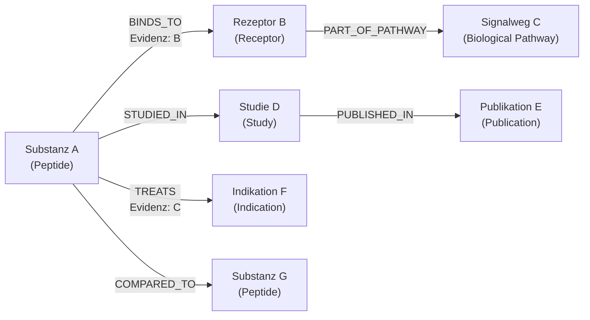

# Knowledge Graph

Peptide Atlas wird **nicht als Wiki**, sondern als **Graph** gedacht: Artikel sind die menschenlesbare Darstellung von Knoten (Nodes) und ihren Beziehungen (Edges), nicht die primäre Datenstruktur selbst.

!!! info "Konkrete Umsetzung seit Phase 3"
    Dieses Dokument beschreibt weiterhin das Denkmodell. Die konkrete, lauffähige Umsetzung ist seit Phase 3
    vorhanden: `python tools/export_graph.py` erzeugt `build/graph.json` (Nodes aus Entitäten unter
    `data/entities/**`, Edges ausschließlich aus Claims mit einem `object.entity_id`, validiert gegen
    `schemas/relationship.schema.json`). Siehe [Phase 3 Dokumentation](Phase_3_Scientific_Data_Architecture.md).

    Die seit Phase 4A bestehende Recherche-/Provenienzebene (`research/**`, siehe ADR-0033 im
    [Decision Log](Decision_Log.md)) fließt bewusst **nicht** in den Graphexport ein — Kandidaten und
    Screening-Entscheidungen sind kein kanonisches Wissen. Erst ein daraus promotierter aktiver Claim erzeugt
    eine Edge (siehe [Evidence Curation Workflow](Evidence_Curation_Workflow.md)).

!!! info "Rein strukturelles Beispiel"
    Alle Beispiele auf dieser Seite verwenden Platzhalternamen („Substanz A", „Rezeptor B" …). Es handelt sich um keine echten medizinischen Aussagen, sondern ausschließlich um eine Illustration der Graphstruktur.

## Nodes

Ein Node entspricht genau einem Objekt aus dem [Data Model](Data_Model.md) — z. B. ein `Peptide`, ein `Receptor`, eine `Study`. Jeder Node trägt:

- seine `id` und seinen `type`
- seine Basisfelder (`title`, `synonyms`, `description`, `status`, `sources`)
- keine eingebetteten Beziehungen als Freitext — Beziehungen werden ausschließlich als Edges modelliert

## Edges

Eine Edge verbindet zwei Nodes über einen benannten Beziehungstyp und trägt **eigene** Metadaten:

| Feld | Beschreibung |
|---|---|
| `relation_type` | z. B. `BINDS_TO`, `TREATS`, `STUDIED_IN` (siehe [Data Model](Data_Model.md)) |
| `from` / `to` | IDs der verbundenen Nodes |
| `sources` | Quellen, die genau diese Beziehung belegen |
| `evidenzstufe` | Evidenzstufe **dieser spezifischen Beziehung** (siehe [Evidenzsystem](../00_grundlagen/evidenzsystem.md)) |
| `status` | `Entwurf` \| `In Prüfung` \| `Aktiv` — Beziehungen durchlaufen denselben Redaktionsprozess wie Artikel |

Damit ist Evidenz immer an der **Aussage** (der Edge) verankert, nicht pauschal am Objekt — ein zentrales Prinzip aus dem [Data Model](Data_Model.md).

!!! note "Namenskonvention: `relation_type` vs. `predicate`"
    Diese Seite verwendet zur Illustration `UPPER_CASE`-Bezeichner wie `BINDS_TO`. Die konkrete Umsetzung in
    Phase 3 nennt dasselbe Feld `predicate` und verwendet `lower_snake_case` (z. B. `binds_to`), passend zu den
    übrigen maschinenlesbaren Enums (siehe [Naming Conventions](Naming_Conventions.md)). Es handelt sich um
    dieselbe Beziehung, nur mit dem in Phase 3 verbindlich festgelegten Schreibstil — das kontrollierte
    Vokabular steht in `data/vocabularies/predicates.yaml`.

## Illustratives Beispiel (Platzhalterdaten)

Dieses Diagramm zeigt ausschließlich die **Struktur** möglicher Beziehungen — keine der Bezeichnungen A–G steht für eine reale Substanz, einen realen Rezeptor oder eine reale Studie.

## Wie ein Artikel und der Graph zusammenhängen

- Der Markdown-Artikel (z. B. unter `docs/01_wirkstoffe/`) bleibt die **primäre, redaktionell gepflegte Quelle** (siehe [Architecture](Architecture.md), Prinzip „Static-First").
- Beziehungen, die im Artikel erwähnt werden (z. B. „bindet an Rezeptor X"), werden **zusätzlich** als strukturierte Relation erfasst — zunächst im YAML-Frontmatter des Artikels, später optional in einer eigenen Graph-Datenschicht (`data/`).
- Der Graph wird aus diesen strukturierten Angaben **abgeleitet**, nicht umgekehrt. Es gibt in absehbarer Zeit **keine automatische Rückschreibung** von Graphänderungen in die Artikel.

## Automatisch entstehende Beziehungen (Zukunftsbild)

Langfristig denkbar, aber **nicht Teil der aktuellen Phase**:

1. Ein Analyse-Schritt (z. B. NLP-gestützt) schlägt mögliche neue Beziehungen vor, indem er Artikeltexte und bestehende Relationen abgleicht (z. B. „Substanz A und Substanz G werden in Studie D gemeinsam erwähnt → mögliche `COMPARED_TO`-Relation").
2. Solche Vorschläge werden **niemals automatisch veröffentlicht**. Sie erscheinen als Entwurf mit Status `Entwurf` und müssen redaktionell geprüft und bestätigt werden — analog zu jedem anderen Beitrag (siehe [Contribution Guide](Contribution_Guide.md), [Quality Standards](Quality_Standards.md)).
3. Erst nach redaktioneller Freigabe wird eine vorgeschlagene Relation Teil des aktiven Graphen.

## Nutzen des Graphmodells

- **Vergleiche** (Content-Bereich [Vergleiche](../05_vergleiche/index.md)) werden zu Abfragen über `COMPARED_TO`/`SIMILAR_TO`-Kanten statt manuell gepflegter Tabellen.
- **Rezeptor-Übersichten** lassen sich automatisch aus `BINDS_TO`- und `PART_OF_PATHWAY`-Kanten ableiten.
- **Studienbrowser** (siehe [Future Roadmap](Future_Roadmap.md)) kann über `STUDIED_IN`/`PUBLISHED_IN`-Kanten gefiltert und durchsucht werden.
- Ein **Export** (z. B. JSON-LD oder GraphML) macht die Daten für externe Forschungswerkzeuge nutzbar, ohne dass Peptide Atlas selbst eine Graphdatenbank betreiben muss (siehe [Architecture](Architecture.md)).

## Abgrenzung

Dieses Dokument beschreibt das **Denkmodell**. Die konkrete technische Umsetzung (Dateiformat, Speicherort, Tooling) ist bewusst nicht Teil dieser Phase und wird in [Release Strategy](Release_Strategy.md) den passenden Versionen zugeordnet.
